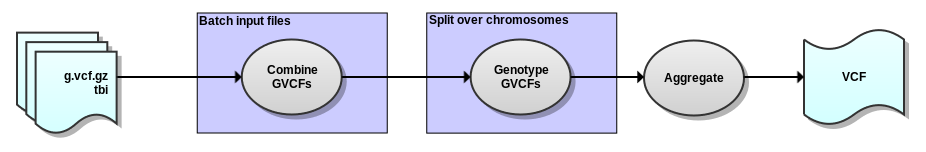

## GATK Genotype GVCFs workflow

Version 1.0

###Overview

Uses [gVCF](https://www.broadinstitute.org/gatk/guide/article?id=4017) (g.vcf.gz) files produced by GATK Haplotype Caller (3.0+) as input and produces a VCF (vcf.gz) with raw indel and SNV variant calls using GATK Genotype GVCFs.

###Process

###Dependencies

This workflow requires:

* [SeqWare](http://seqware.github.io/)
* [GATK](https://www.broadinstitute.org/gatk/)

###Compile

    mvn clean install

###Usage

After compilation, [test](http://seqware.github.io/docs/3-getting-started/developer-tutorial/#testing-the-workflow), [bundle](http://seqware.github.io/docs/3-getting-started/developer-tutorial/#packaging-the-workflow-into-a-workflow-bundle) and [install](http://seqware.github.io/docs/3-getting-started/admin-tutorial/#how-to-install-a-workflow) the workflow using the techniques described in the SeqWare documentation.

###Options

These parameters can be overridden either in the INI file on on the command line using `--override` when [directly scheduling workflow runs](http://seqware.github.io/docs/3-getting-started/user-tutorial/#listing-available-workflows-and-their-parameters) (not using a decider).

#####Required:

Parameter | Description
---|---
identifier | The prefix for all output files
input_files | The comma-separated absolute paths of the input BAM and BAI files

#####Optional:

Parameter | Description | Default
---|---|---
Input/Output: ||
output_dir | A standard SeqWare parameter specifying the sub-directory where the output files will be moved | seqware-results
output_prefix | A standard SeqWare parameter specifying the root directory where the output files will be moved | ./
manual_output | Whether or not to use manual output. When false, a random integer will be inserted into the path of the file in order to ensure uniqueness. When true, the output files will be moved to the location of output_prefix/output_dir | false
||
Dependency configuration: ||
gatk_jar | The GATK jar path | $\{workflow_bundle_dir}/Workflow_Bundle_$\{project.artifactId}/$\{project.version}/bin/
java | The java executable path | $\{workflow_bundle_dir}/Workflow_Bundle_$\{project.artifactId}/$\{project.version}/bin/
||
GATK configuration: ||
gatk_key | The absolute path to the GATK key to prevent "phoning home" | /.mounts/labs/PDE/data/gatkAnnotationResources/GATK_public.key
ref_fasta | The reference genome against which the sequence data was mapped | /oicr/data/reference/genomes/homo_sapiens_mc/UCSC/hg19_random/Genomic/references/fasta/original/hg19_random.fa
chr_sizes | The numbers and sizes of the chromosomes. These values are used for parallelization across chromosomes and chromosome intervals. The format is: chromosome_name1:start-endinterval1,chromosome_name2:start-endinterval2 | chr1,chr2,chr3,chr4,chr5,chr6,chr7,chr8,chr9,chr10,chr11,chr12,chr13,chr14,chr15,chr16,chr17,chr18,chr19,chr20,chr21,chr22,chrX,chrY,chrM
gatk_genotype_gvcfs_max_input_files | When the number of input files is greater than this threshold, start combining input files | 200
gatk_combine_gvcfs_max_input_files | The maximum number of input files to batch/combine in a job | 50
gatk_genotype_gvcfs_params | Additional params to pass directly to GenotypeGVCFs |  
||
Memory/HPC configuration: ||
queue | The HPC queue to submit jobs to | N |
gatk_sched_overhead_mem |  Additional memory to add to Xmx settings to calculate the requested memory for a HPC job (GB) | N | 4
gatk_combine_gvcfs_xmx | The java max heap size for GATK Combine/Cat GVCFs commands (GB) | N | 4
gatk_genotype_gvcfs_xmx | The java max heap size for GATK Genotype GVCFs commands (GB) | N | 8

###Output files

* VCF.GZ file - compressed and sorted vcf file of indels and SNVs
* TBI file - index file for corresponding vcf.gz file

###Support

For support, please file an issue on the [Github project](https://github.com/oicr-gsi) or send an email to gsi@oicr.on.ca .