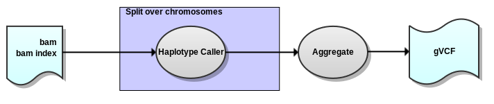

## GATK Haplotype Caller workflow

Version 1.1

###Overview

Uses BAM files (filtered, merged, and collapsed/duplicates marked) as input, performs indel realignment, base quality score recalibration, and produces a [gVCF](https://www.broadinstitute.org/gatk/guide/article?id=4017) (g.vcf.gz) file with indel and SNV genotype confidence using GATK Haplotype Caller.

###Process

###Dependencies

This workflow requires:

* [SeqWare](http://seqware.github.io/)
* [GATK](https://www.broadinstitute.org/gatk/)
* [R](https://www.r-project.org/)

###Compile

    mvn clean install

###Usage

After compilation, [test](http://seqware.github.io/docs/3-getting-started/developer-tutorial/#testing-the-workflow), [bundle](http://seqware.github.io/docs/3-getting-started/developer-tutorial/#packaging-the-workflow-into-a-workflow-bundle) and [install](http://seqware.github.io/docs/3-getting-started/admin-tutorial/#how-to-install-a-workflow) the workflow using the techniques described in the SeqWare documentation.

###Options

These parameters can be overridden either in the INI file on on the command line using `--override` when [directly scheduling workflow runs](http://seqware.github.io/docs/3-getting-started/user-tutorial/#listing-available-workflows-and-their-parameters) (not using a decider).

#####Required:

Parameter | Description
---|---
identifier | The prefix for all output files
input_files	| The comma-separated absolute paths of the input BAM and BAI files
gatk_dbsnp_vcf | The absolute path to the dbSNP VCF file

#####Optional:

Input/Output:

Parameter | Description | Default
---|---|---
output_dir | A standard SeqWare parameter specifying the sub-directory where the output files will be moved | seqware-results
output_prefix | A standard SeqWare parameter specifying the root directory where the output files will be moved | ./
manual_output | Whether or not to use manual output. When false, a random integer will be inserted into the path of the file in order to ensure uniqueness. When true, the output files will be moved to the location of output_prefix/output_dir | false

Dependency configuration:

Parameter | Description | Default
---|---|---
gatk_jar | The GATK jar path | $\{workflow_bundle_dir}/Workflow_Bundle_$\{project.artifactId}/$\{project.version}/bin/
r_dir | The R installation directory (required for AnalyzeCovariates) | /oicr/local/analysis/sw/R/R-3.1.0/
java | The java executable path | $\{workflow_bundle_dir}/Workflow_Bundle_$\{project.artifactId}/$\{project.version}/bin/

GATK configuration:

Parameter | Description | Default
---|---|---
gatk_key | The absolute path to the GATK key to prevent "phoning home" | /.mounts/labs/PDE/data/gatkAnnotationResources/GATK_public.key
ref_fasta | The reference genome against which the sequence data was mapped | /oicr/data/reference/genomes/homo_sapiens_mc/UCSC/hg19_random/Genomic/references/fasta/original/hg19_random.fa
chr_sizes | The numbers and sizes of the chromosomes. These values are used for parallelization across chromosomes and chromosome intervals. The format is: chromosome_name1:start-endinterval1,chromosome_name2:start-endinterval2 | 
interval_files | Absolute path(s) to interval BED file(s) that GATK will operate on | 
interval_padding | Amount of padding to add it each interval | 100
downsampling_coverage | Target coverage for downsampling |
downsampling_type | Method for downsampling | 
do_bqsr	| true = recalibrate realigned bams, false = pass realigned bams directly to HC/UG | true
preserve_qscores_less_than | Don't recalibrate bases with quality scores less than this threshold | 6
bqsr_covariates | Covariates to be used in the recalibration | ReadGroupCovariate,QualityScoreCovariate,CycleCovariate,ContextCovariate,RepeatLengthCovariate,RepeatUnitCovariate,RepeatUnitAndLengthCovariate
gatk_realigner_target_creator_params | Additional params to pass directly to RealignerTargetCreator | 
gatk_indel_realigner_params	 | Additional params to pass directly to IndelRealigner | 
gatk_baserecalibrator_params | Additional params to pass directly to BaseRecalibrator | 
gatk_analyze_covariates_params | Additional params to pass directly to AnalyzeCovariates | 
gatk_print_reads_params	 | Additional params to pass directly to PrintReads | 
gatk_haplotype_caller_params | Additional params to pass directly to HaplotypeCaller |	 

Memory/HPC configuration:

Parameter | Description | Default
---|---|---
queue | The HPC queue to submit jobs to |
gatk_sched_overhead_mem |  Additional memory to add to Xmx settings to calculate the requested memory for a HPC job (GB) | 4
gatk_realign_target_creator_xmx | The java max heap size for GATK RealignTargetCreator jobs (GB) | 12
gatk_indel_realigner_xmx | The java max heap size for GATK IndelRealigner jobs (GB) | 12
gatk_print_reads_xmx | The java max heap size for GATK PrintReads jobs (GB) | 12
gatk_haplotype_caller_threads | The number of java threads for GATK Haplotyper commands | 8
gatk_haplotype_caller_xmx | The java max heap size for GATK HaplotypeCaller jobs (GB) | 12
gatk_combine_gvcfs_xmx | The java max heap size for combine split gvcf jobs (GB) | 4
gatk_base_recalibrator_xmx | The java max heap size for GATK BaseRecalibrator commands (MB) | 8192
gatk_base_recalibrator_mem | The amount of memory to request for GATK BaseRecalibrator jobs (MB) | 9728
gatk_base_recalibrator_nct | The number of java threads for GATK BaseRecalibrator commands | 24
gatk_base_recalibrator_smp | The number of slots to request for GATK BaseRecalibrator jobs | 20

###Output files

* G.VCF.GZ file - compressed genomic vcf file of indels and SNVs
* TBI file - index file for corresponding g.vcf.gz file
* PDF file - report visualizing the quality of a recalibration run (only if do_bqsr = true)

###Support
For support, please file an issue on the [Github project](https://github.com/oicr-gsi/gatk3) or send an email to gsi@oicr.on.ca .
