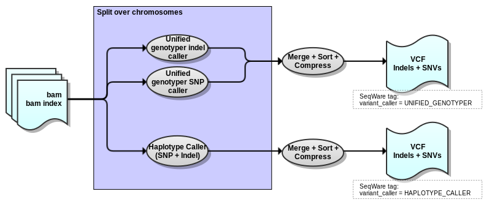

## GATK3 workflow

Version 1.3

###Overview

Uses BAM files (filtered, merged, collapsed/duplicates marked, indel realigned, and/or recalibrated) as input to produce a VCF (vcf.gz) with raw indel and SNV variant calls using GATK Haplotype Caller and/or GATK Unified Genotyper.

###Process

###Dependencies

This workflow requires:

* [SeqWare](http://seqware.github.io/)
* [GATK](https://www.broadinstitute.org/gatk/)
* [tabix](http://www.htslib.org/doc/tabix.html)

###Compile

    mvn clean install

###Usage

After compilation, [test](http://seqware.github.io/docs/3-getting-started/developer-tutorial/#testing-the-workflow), [bundle](http://seqware.github.io/docs/3-getting-started/developer-tutorial/#packaging-the-workflow-into-a-workflow-bundle) and [install](http://seqware.github.io/docs/3-getting-started/admin-tutorial/#how-to-install-a-workflow) the workflow using the techniques described in the SeqWare documentation.

###Options

These parameters can be overridden either in the INI file on on the command line using `--override` when [directly scheduling workflow runs](http://seqware.github.io/docs/3-getting-started/user-tutorial/#listing-available-workflows-and-their-parameters) (not using a decider).

#####Required:

Parameter | Description
---|---
identifier | The prefix for all output files
input_files	| The comma-separated absolute paths of the input BAM and BAI files
gatk_dbsnp_vcf | The absolute path to the dbSNP VCF file

#####Optional:

Input/Output:

Parameter | Description | Default
---|---|---
output_dir | A standard SeqWare parameter specifying the sub-directory where the output files will be moved | seqware-results
output_prefix | A standard SeqWare parameter specifying the root directory where the output files will be moved | ./
manual_output | Whether or not to use manual output. When false, a random integer will be inserted into the path of the file in order to ensure uniqueness. When true, the output files will be moved to the location of output_prefix/output_dir | false

Dependency configuration:

Parameter | Description | Default
---|---|---
gatk_jar | The GATK jar path | $\{workflow_bundle_dir}/Workflow_Bundle_$\{project.artifactId}/$\{project.version}/bin/
perl | The perl executable path | perl
java | The java executable path | $\{workflow_bundle_dir}/Workflow_Bundle_$\{project.artifactId}/$\{project.version}/bin/
tabix_dir | The tabix installation directory | $\{workflow_bundle_dir}/Workflow_Bundle_$\{project.artifactId}/$\{project.version}/bin/

GATK configuration:

Parameter | Description | Default
---|---|---
gatk_key | The absolute path to the GATK key to prevent "phoning home" | /.mounts/labs/PDE/data/gatkAnnotationResources/GATK_public.key
ref_fasta | The reference genome against which the sequence data was mapped | /oicr/data/reference/genomes/homo_sapiens_mc/UCSC/hg19_random/Genomic/references/fasta/original/hg19_random.fa
chr_sizes | The numbers and sizes of the chromosomes. These values are used for parallelization across chromosomes and chromosome intervals. The format is: chr1_name:start-end1,chr2_name:start-end2 |
interval_files | Absolute path(s) to interval BED file(s) that GATK will operate on | 
interval_padding | Amount of padding to add it each interval | 100
variant_caller | The GATK variant caller to use (unified_genotyper and/or haplotype_caller) | haplotype_caller
downsampling_coverage | Target coverage for downsampling |
downsampling_type | Method for downsampling | 
stand_call_conf	| The call confidence below which a variant will not be called | 30
stand_emit_conf	| The emit confidence below which a variant will not be emitted | 1
haplotype_caller_output_mode | What type of calls HaplotypeCaller should output | emit_variants_only
haplotype_caller_genotyping_mode | Method to determine the alternate alleles to use for genotyping | discovery
gatk_haplotype_caller_params | Additional params to pass directly to HaplotypeCaller |
gatk_unified_genotyper_params | Additional params to pass directly to UnifiedGenotyper |

Memory/HPC configuration:

Parameter | Description | Default
---|---|---
queue | The HPC queue to submit jobs to |
gatk_sched_overhead_mem |  Additional memory to add to Xmx settings to calculate the requested memory for a HPC job (GB) | 4
gatk_haplotype_caller_threads | The number of java threads for GATK Haplotyper commands | 8
gatk_haplotype_caller_xmx | The java max heap size for GATK HaplotypeCaller jobs (GB) | 12
gatk_unified_genotyper_threads | The number of java threads for GATK UnifiedGenotyper commands | 8
gatk_unified_genotyper_xmx | The java max heap size for GATK UnifiedGenotyper jobs (GB) | 12

###Output files

* VCF.GZ file - compressed and sorted vcf file of indels and SNVs
* TBI file - index file for corresponding vcf.gz file

###Support
For support, please file an issue on the [Github project](https://github.com/oicr-gsi/gatk3) or send an email to gsi@oicr.on.ca .
